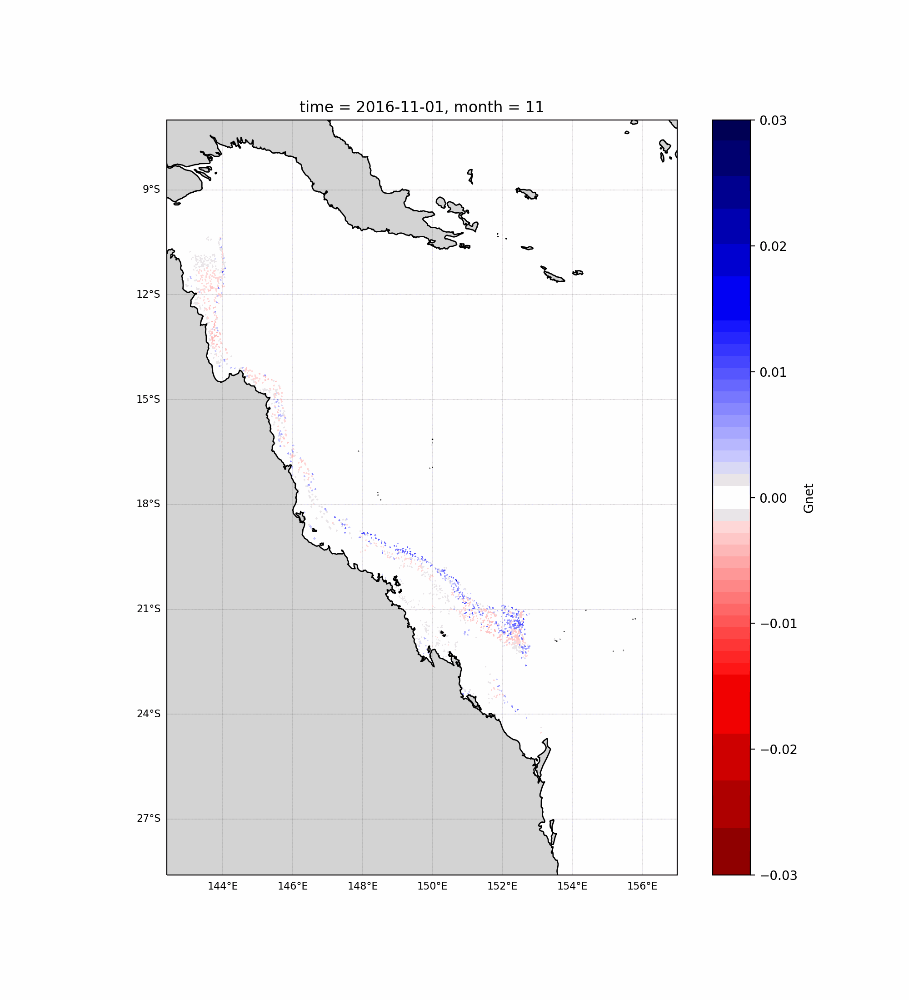

# Net Reef Calcification in Response to Climate Change

## Background

Severe environmental degradation and global climate change as a result of anthropogenic activities are a defining characteristic of the Anthropocene. At the current rate of climate change, ecosystems once thought to be inexhaustible are beginning to display increasingly damaging stress that is both persistent and acute. Loss of biodiversity and habitat are becoming more regular and some ecosystems are beginning to locally collapse under the consistent pressures of human demand and elevated atmospheric carbon dioxide (CO2) levels. The marine environment is no exception and is becoming increasingly impacted from the combined effects of increased sea surface temperature (SST), ocean acidification and ocean deoxygenation.

Coral reefs are large biological structures situated in shallow, tropical coastal waters. As flagship ecosystems, they support 25% of all marine species and provide 10% of global fisheries despite covering <0.1% of the ocean floor. As such, coral reefs represent an important natural resource that directly provides ecosystem services and economic opportunities to 0.5 billion people worldwide.In Australia, the Great Barrier Reef (GBR) alone is composed of 2,900 individual reefs, supports exceptional levels of biodiversity (600 species of coral, 1625 species of fish), and is valued in excess of ~$65 billion (Harriott, 2001; Economics, 2017).  The GBR is recognised as a UNESCO World Heritage Site and directly provides employment for 65,000 people through a combination of ecotourism and fisheries. But current estimates indicate that ca. 65% of corals have been lost worldwide as a result, with the GBR losing ca. 30% of hard corals following sequential mass-bleaching events in 2016 and 2017 which were linked to marine heatwaves. 

Calcification is significant proxy for coral health. The process of precipitation of calcium carbonate by the coral organism is both represetnative of metabolic function, growth and environmental impacts on corals. As such coral calcification represents a measure of health of individual coral, reefs and the whole GBR.


Figure 1: Monthly average Net reef calcification anomolies (mg/m-2/day-1) ranging from 2016-2019. Data sourced from <a href="https://portal.ereefs.info/map" target="_top">AIMS eReefs</a>

## Hypothesis

The purpose of the following code is to adress the question:

### “What is the effect of changing temperature and pH levels on coral calcification in the Great Barrier Reef?”

In order to do so this repositry provides a series of notebooks to extract, forecast and predict net calcification data for reefs across the GBR to 2061

## 1. <a href="1. Reef Data.ipynb" target="_top"> Reef Data</a>

This section outlines the process for collection and cleaning of data from the eReefs dataset.

```python


```
